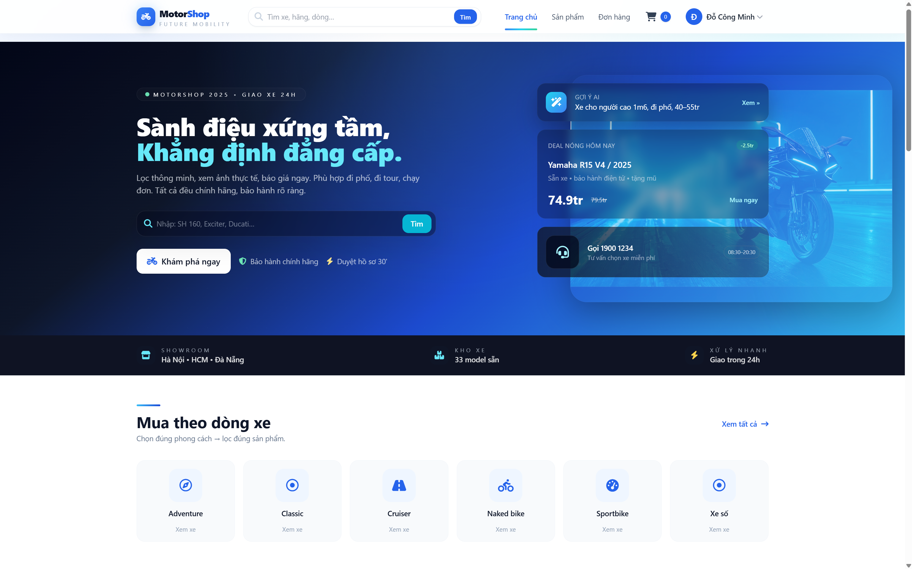
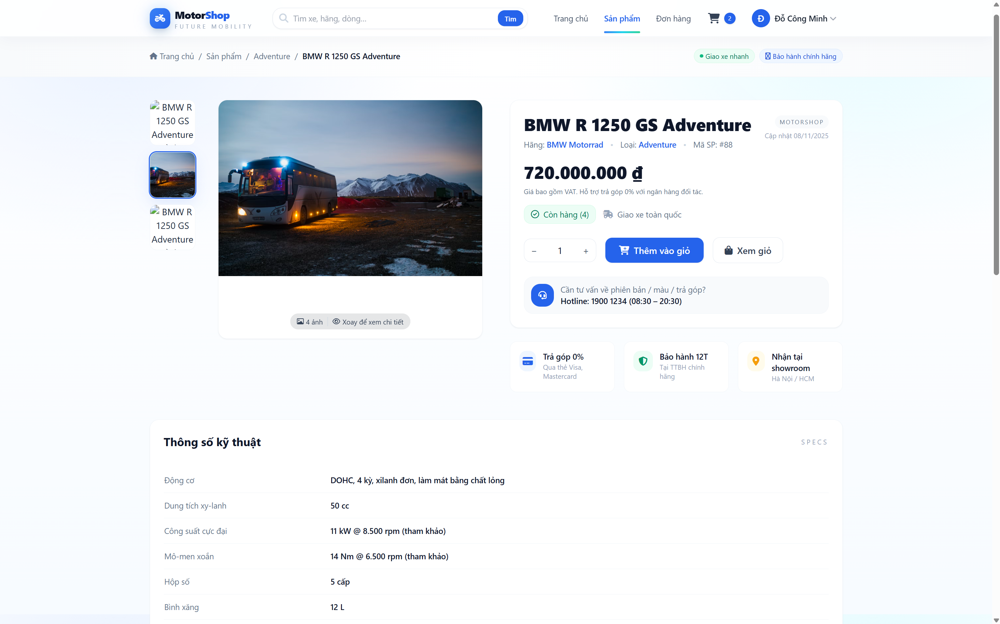
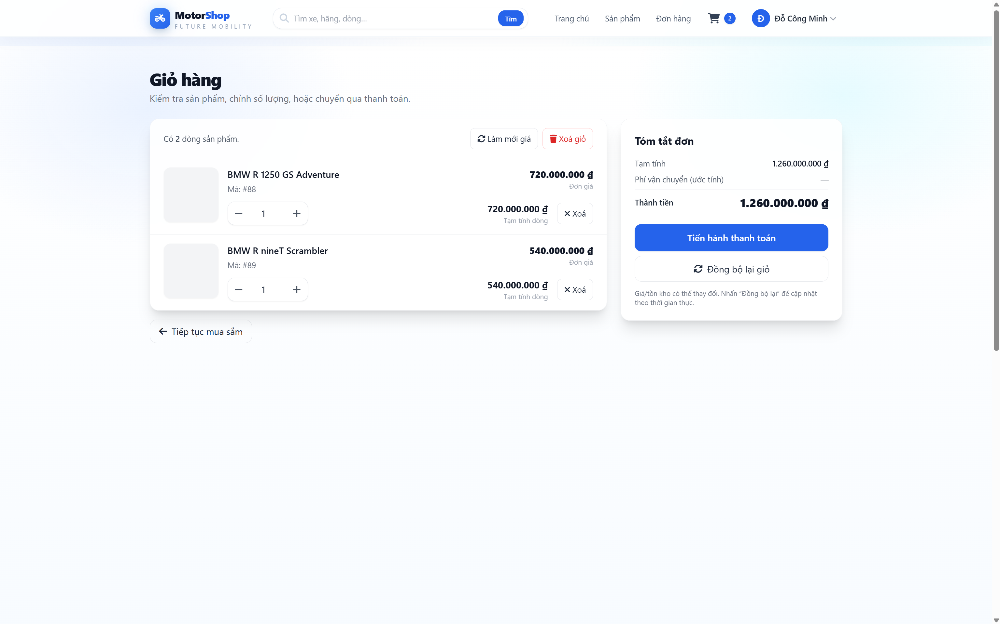
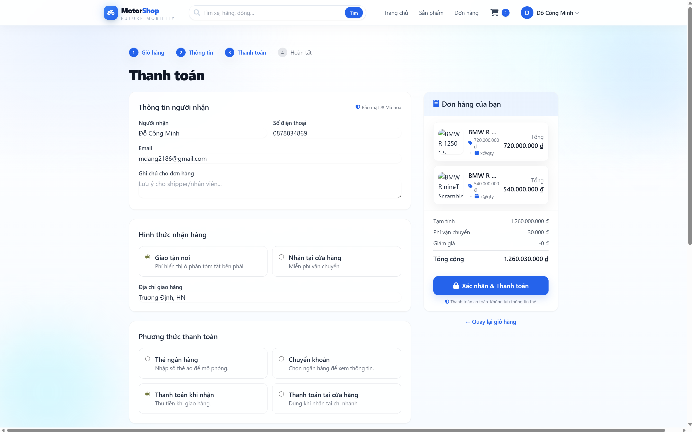
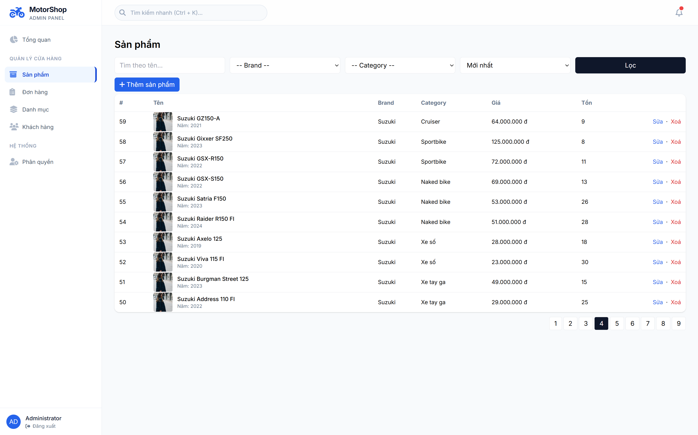
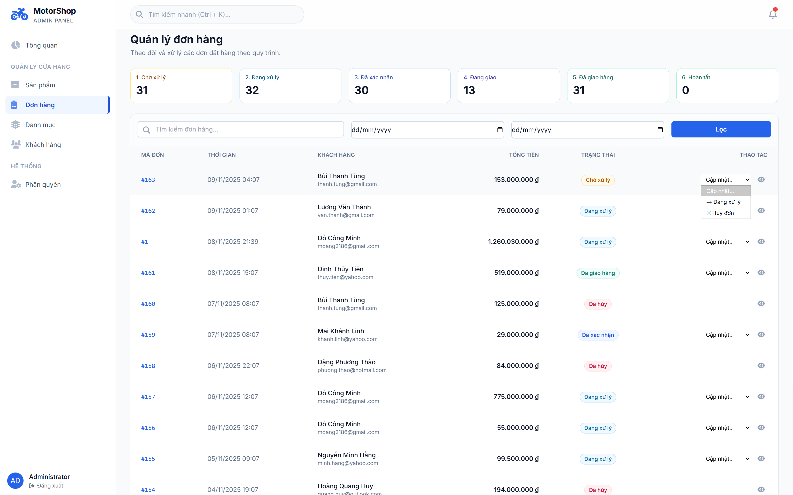

# MotorShop — Website Bán Xe Máy (ASP.NET Core MVC, .NET 9.0)

Website thương mại điện tử bán **xe máy**, gồm **Storefront** cho khách hàng và **Admin** cho quản trị. Mục tiêu: triển khai trọn luồng e‑commerce (catalog → giỏ hàng → thanh toán → quản trị đơn hàng) với bảo mật người dùng bằng **ASP.NET Core Identity**.

> **Repo:** `https://github.com/Mdang2186/MotorShop` · **Nhánh mặc định:** `main`  
> **Phân công:** **Minh** — Team Lead & Frontend/UI‑UX · **Hiếu** — Backend/Database/DevOps

---

## Mục lục
- [Tính năng](#tính-năng)
- [Công nghệ & Kiến trúc](#công-nghệ--kiến-trúc)
- [Cấu trúc thư mục](#cấu-trúc-thư-mục)
- [Yêu cầu hệ thống](#yêu-cầu-hệ-thống)
- [Bắt đầu nhanh](#bắt-đầu-nhanh)
  - [Clone từ nhánh main](#clone-từ-nhánh-main)
  - [Cấu hình chuỗi kết nối](#cấu-hình-chuỗi-kết-nối)
  - [Migrations & khởi tạo CSDL](#migrations--khởi-tạo-csdl)
  - [Seed Roles & Admin](#seed-roles--admin)
  - [Chạy ứng dụng](#chạy-ứng-dụng)
- [Hướng dẫn sử dụng](#hướng-dẫn-sử-dụng)
- [Endpoints tham khảo](#endpoints-tham-khảo)
- [Ảnh màn hình](#ảnh-màn-hình)
- [Troubleshooting](#troubleshooting)
- [Roadmap](#roadmap)
- [Đóng góp & Quy ước Git](#đóng-góp--quy-ước-git)
- [Thành viên thực hiện](#thành-viên-thực-hiện) 
---

## Tính năng

### Storefront (khách hàng)
- Duyệt **danh mục**, **tìm kiếm**, **lọc/sắp xếp** (mới nhất, giá ↑/↓), **phân trang**.
- **Chi tiết sản phẩm**: mô tả, ảnh (đa ảnh), thông số kỹ thuật, tồn kho.
- **Giỏ hàng**: thêm / cập nhật số lượng / xoá; tính tổng tiền.
- **Checkout**: nhập thông tin nhận hàng, ghi chú; thanh toán mặc định **COD**.
- **Tài khoản**: đăng ký/đăng nhập, cập nhật hồ sơ, đổi mật khẩu.
- **Đơn hàng của tôi**: danh sách & chi tiết đơn đã đặt.

### Admin (quản trị)
- **Dashboard**: số liệu tổng quan, biểu đồ Chart.js, cảnh báo tồn kho.
- **Danh mục**: CRUD, thứ tự hiển thị.
- **Sản phẩm**: CRUD, ảnh đa ảnh (caption/sort), thông số kỹ thuật, tồn kho.
- **Đơn hàng**: duyệt/cập nhật trạng thái (Pending → Confirmed → Shipping → Completed/Cancelled).
- **Người dùng & vai trò**: danh sách user, gán role (`Admin`, `Staff`, `Customer`).
- **Báo cáo**: doanh thu theo thời gian, top sản phẩm bán chạy.

---

## Công nghệ & Kiến trúc

- **Nền tảng:** ASP.NET Core MVC (**net9.0**)  
- **ORM/CSDL:** Entity Framework Core 9 (Code‑First) + Microsoft SQL Server  
- **Xác thực:** ASP.NET Core Identity (Users/Roles/Claims, Cookie Auth)  
- **Frontend:** Tailwind CSS _hoặc_ Bootstrap 5, Font Awesome  
- **Biểu đồ:** Chart.js (Admin Dashboard)  
- **Triển khai:** Kestrel/IIS (có thể Docker hoá)

**Phân lớp (định hướng):**
- `Controllers` — điều phối request, validation cơ bản  
- `Services/Repositories` — nghiệp vụ & truy xuất dữ liệu  
- `Data` — `ApplicationDbContext`, `Migrations`, seed dữ liệu  
- `Models` — Entities, ViewModels/DTOs, Identity  
- `Views` — Razor Views + partials/layout  
- `Utilities` — `SD.cs` (roles, status, TempData keys), helpers

---

## Cấu trúc thư mục

```
MotorShop/
├─ MotorShop.sln
└─ MotorShop/                      # Web project
   ├─ Areas/
   │  └─ Admin/
   │     ├─ Controllers/          # Product, Category, Order, User, Dashboard
   │     └─ Views/                # Products, Categories, Orders, Users, Dashboard
   ├─ Controllers/                 # Home, Shop, Product(front), Cart, Order(front), Account, ...
   ├─ Data/
   │  ├─ ApplicationDbContext.cs   # DbContext + DbSet<...>
   │  └─ Migrations/               # EF Core migrations
   ├─ Models/
   │  ├─ Entities/                 # Category, Product, ProductImage, ProductSpecification, Order, OrderItem, ...
   │  ├─ Identity/                 # ApplicationUser : IdentityUser
   │  └─ ViewModels/DTOs/          # DTO/Paging/Filters
   ├─ Services/                    # (tuỳ chọn) Business/Repository layer
   ├─ Utilities/                   # SD.cs (Roles/Statuses/TempData keys), Helpers
   ├─ Views/
   │  ├─ Shared/                   # _Layout, _HeaderPartial, _FooterPartial, ...
   │  └─ Home/ Shop/ Product/ Cart/ Order/ Account/ ...
   ├─ wwwroot/                     # css, js, images, libs
   ├─ appsettings.json
   ├─ Program.cs
   └─ Startup.cs (nếu dùng pattern cũ)
```

---

## Yêu cầu hệ thống
- **.NET SDK 9.0**  
- **SQL Server** (LocalDB/Express)  
- **Visual Studio 2022 17.12+** (hoặc JetBrains Rider bản hỗ trợ .NET 9)  
- **EF Core Tools 9** (khuyến nghị):  
  ```bash
  dotnet tool install --global dotnet-ef
  dotnet ef --version   # xác nhận 9.x
  ```

---

## Bắt đầu nhanh

### Clone từ nhánh main
```bash
git clone https://github.com/Mdang2186/MotorShop.git
cd MotorShop
# Nhánh mặc định: main
# Nếu cần nhánh làm việc cá nhân:
git checkout -b dev-minh   # hoặc dev-hieu
```

### Cấu hình chuỗi kết nối
Sửa `MotorShop/appsettings.json`:
```json
{
  "ConnectionStrings": {
    "DefaultConnection": "Server=(localdb)\\MSSQLLocalDB;Database=MotorShopDb;Trusted_Connection=True;MultipleActiveResultSets=true"
  },
  "Logging": { "LogLevel": { "Default": "Information", "Microsoft.AspNetCore": "Warning" } },
  "AllowedHosts": "*"
}
```
> **SQL Express/Server thật:**  
> `Server=.;Database=MotorShopDb;User Id=sa;Password=***;TrustServerCertificate=True;MultipleActiveResultSets=true`

### Migrations & khởi tạo CSDL
**Trường hợp A — Repo đã có migrations:**
```bash
# Chạy tại thư mục chứa .csproj (MotorShop/)
dotnet ef database update
```

**Trường hợp B — Tạo migrations mới (reset/khởi tạo):**
```bash
dotnet ef migrations add Init
dotnet ef database update
```
**Visual Studio (Package Manager Console) tương đương:**
```
Add-Migration Init
Update-Database
```

### Seed Roles & Admin
Khuyến nghị seed các roles (`Admin`, `Staff`, `Customer`) và tài khoản admin mẫu:
- **Admin:** `admin@motorshop.local / Admin@123` *(đổi ở môi trường thật)*

_Gợi ý snippet_:
```csharp
// Data/DbInitializer.cs
using Microsoft.AspNetCore.Identity;

public static class DbInitializer
{
    public static async Task SeedAsync(IServiceProvider sp)
    {
        using var scope = sp.CreateScope();
        var roleMgr = scope.ServiceProvider.GetRequiredService<RoleManager<IdentityRole>>();
        var userMgr = scope.ServiceProvider.GetRequiredService<UserManager<ApplicationUser>>();

        string[] roles = { "Admin", "Staff", "Customer" };
        foreach (var r in roles)
            if (!await roleMgr.RoleExistsAsync(r))
                await roleMgr.CreateAsync(new IdentityRole(r));

        var adminEmail = "admin@motorshop.local";
        var admin = await userMgr.FindByEmailAsync(adminEmail);
        if (admin is null)
        {
            admin = new ApplicationUser { UserName = adminEmail, Email = adminEmail, EmailConfirmed = true };
            await userMgr.CreateAsync(admin, "Admin@123");
            await userMgr.AddToRolesAsync(admin, new[] { "Admin", "Staff" });
        }
    }
}
```
Gọi trong `Program.cs` (sau khi build `app`, trước `app.Run()`):
```csharp
await DbInitializer.SeedAsync(app.Services);
```

### Chạy ứng dụng
```bash
dotnet run --project MotorShop/MotorShop.csproj
```
Mặc định: `https://localhost:{port}/`

---

## Hướng dẫn sử dụng

### Luồng khách hàng
1. Vào **Shop** để tìm kiếm/lọc/sắp xếp; chọn **Chi tiết** để xem thông tin, ảnh, thông số.  
2. Thêm sản phẩm vào **Giỏ hàng**, tăng/giảm số lượng, xoá khi cần.  
3. **Checkout**: nhập thông tin người nhận, địa chỉ, điện thoại, ghi chú; thanh toán **COD**.  
4. Theo dõi **Đơn hàng của tôi** để xem lịch sử và chi tiết đơn.

### Luồng quản trị
1. Đăng nhập bằng user có role `Admin/Staff`.  
2. **Dashboard** xem số liệu tổng quan, biểu đồ.  
3. **Danh mục/Sản phẩm**: CRUD, ảnh đa ảnh (caption/sort), thông số, tồn kho.  
4. **Đơn hàng**: duyệt/cập nhật trạng thái (Pending → Confirmed → Shipping → Completed/Cancelled).  
5. **Người dùng & Vai trò**: gán role, kiểm soát quyền truy cập.

---

## Endpoints tham khảo

**Storefront**
- `GET /` — Trang chủ  
- `GET /Shop?keyword=&cid=&sort=&page=` — Danh sách sản phẩm  
- `GET /Product/Details/{id}` — Chi tiết sản phẩm  
- `GET /Cart` — Giỏ hàng · `POST /Cart/Add|Update|Remove`  
- `GET|POST /Checkout` — Đặt hàng  
- `GET /Orders` — Lịch sử đơn hàng

**Account**
- `GET|POST /Account/Login | Register | Profile | ChangePassword | Logout`

**Admin** *(cần `[Area("Admin")]` & `[Authorize(Roles="Admin,Staff")]`)*
- `/Admin` — Dashboard  
- `/Admin/Categories` — CRUD  
- `/Admin/Products` — CRUD (+ Images/Specifications)  
- `/Admin/Orders` — Xem/duyệt/cập nhật trạng thái  
- `/Admin/Users` — Danh sách & gán role

---

## Ảnh màn hình

> Đặt ảnh trong `docs/screenshots/` (gợi ý tên file: `01-home.png`, `02-product-detail.png`, `03-cart.png`, `04-checkout.png`, `05-admin-dashboard.png`, `06-admin-products.png`, `07-admin-orders.png`).

<details>
  <summary><b>Giao diện người dùng (Storefront)</b></summary>

  - **H1. Home/Shop**  
    

  - **H2. Product Detail**  
    

  - **H3. Cart**  
    

  - **H4. Checkout**  
    
</details>

<details>
  <summary><b>Khu vực quản trị (Admin)</b></summary>

  - **A1. Admin Dashboard**  
    

  - **A2. Quản lý sản phẩm**  
    

  - **A3. Quản lý đơn hàng**  
    
</details>

---

## Troubleshooting

- **`Invalid object name 'AspNetRoles'`** → Chưa tạo bảng Identity. Chạy migrations & update DB; kiểm tra `ApplicationDbContext : IdentityDbContext<ApplicationUser>` và `AddIdentity().AddEntityFrameworkStores<>()`.
- **Không vào được Admin (403/redirect login)** → Tài khoản chưa có role `Admin/Staff`; seed/gán role. Đảm bảo `[Area("Admin")]` + `[Authorize(Roles="Admin,Staff")]`.
- **Razor lỗi `@page` (RZ2001/RZ2005)** → Đây là MVC View, **xoá `@page`** (chỉ dùng cho Razor Pages).
- **CSS/JS không tải** → Kiểm tra `_Layout.cshtml` (CDN/đường dẫn), `app.UseStaticFiles()`, quyền đọc `wwwroot`.
- **Kết nối SQL lỗi/timeout** → Xem lại Connection String; thêm `TrustServerCertificate=True`, `MultipleActiveResultSets=true`; kiểm tra cổng và quyền user DB.

---

## Roadmap
- [ ] Phân trang + sort + filter đầy đủ ở Admin  
- [ ] Ảnh sản phẩm đa ảnh (upload + caption + sort UI)  
- [ ] Thông số kỹ thuật CRUD UI  
- [ ] Báo cáo doanh thu, top sản phẩm (Chart.js)  
- [ ] Nhật ký thay đổi trạng thái đơn (audit log)  
- [ ] Email/OTP (xác thực, quên mật khẩu)  
- [ ] Unit/Integration Tests  
- [ ] Dockerfile & CI (GitHub Actions)

---

## Đóng góp & Quy ước Git

**Nhánh làm việc (2 người):**
- `main` (ổn định, release) · `develop` (tích hợp) · `dev-minh` (frontend/UI) · `dev-hieu` (backend/DB)

**Quy trình chuẩn:**
1. Tạo/đồng bộ nhánh cá nhân từ `develop`.
2. Commit theo convention: `feat: ...`, `fix: ...`, `docs: ...`, `refactor: ...`, `style: ...`, `chore: ...`.
3. Mở Pull Request vào `develop` → review chéo → merge khi đạt.
4. Trước khi release: squash & merge `develop` → `main`.

---

## Thành viên thực hiện

| STT | Họ và Tên              | Vai trò                               |
|-----|------------------------|---------------------------------------|
| 1   | **Đỗ Công Minh**       | **Team Lead & Frontend/UI‑UX**        |
| 2   | **Đặng Đình Thế Hiếu** | **Backend, Database, DevOps**         |

---
 
